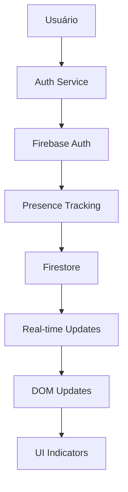

# 👨‍💻 Guia do Desenvolvedor - LexiDecis

## 📋 Índice

1. [Configuração do Ambiente](#configuração-do-ambiente)
2. [Arquitetura do Sistema](#arquitetura-do-sistema)
3. [Sistema de Presença](#sistema-de-presença)
4. [Padrões de Código](#padrões-de-código)
5. [Testes](#testes)
6. [Debugging](#debugging)
7. [Deploy](#deploy)
8. [Troubleshooting](#troubleshooting)

## 🛠️ Configuração do Ambiente

### **Pré-requisitos**

```bash
# Node.js (versão 14+)
node --version

# Python 3 (para servidor local)
python3 --version

# Git
git --version
```

### **Configuração Inicial**

```bash
# 1. Clone o repositório
git clone [url-do-repositorio]
cd lexidecis

# 2. Configure o Firebase
# Copie as credenciais do Firebase Console
# Projeto: lexidecis

# 3. Configure as regras do Firestore
# Acesse: https://console.firebase.google.com/
# Firestore Database → Rules
```

### **Estrutura de Arquivos**

```
lexidecis/
├── 📁 admin/           # Painel administrativo
│   ├── assets/
│   │   ├── css/
│   │   │   ├── admin.css
│   │   │   └── presence.css    # Estilos de presença
│   │   └── js/
│   │       ├── auth.js         # Autenticação + Presença
│   │       ├── dom.js          # DOM + Indicadores
│   │       ├── main.js         # Orquestração
│   │       └── api.js          # APIs
│   ├── users.html              # Gerenciamento de usuários
│   └── index.html              # Dashboard
├── 📁 pages/           # Aplicação principal
├── 📁 services/        # Serviços core
├── 📁 tests/           # Sistema de testes
├── 📁 docs/            # Documentação
└── 📁 instance/        # Instâncias específicas
```

## 🏗️ Arquitetura do Sistema

### **Padrão Modular**

O sistema segue um padrão modular com separação clara de responsabilidades:

```javascript
// Estrutura de módulos
├── auth.js          # Autenticação e presença
├── dom.js           # Manipulação do DOM
├── main.js          # Orquestração
├── api.js           # Comunicação com APIs
└── firebase.js      # Configuração Firebase
```

### **Fluxo de Dados**



### **Sistema de Eventos**

```javascript
// Eventos principais
document.addEventListener('presenceChanged', (event) => {
    const { uid, presence } = event.detail;
    // Atualizar UI
});

document.addEventListener('authStateChanged', (event) => {
    const { user } = event.detail;
    // Gerenciar sessão
});
```

## 👥 Sistema de Presença

### **Componentes Principais**

#### **1. AuthService (auth.js)**
```javascript
const AuthService = {
    // Tracking de presença
    startPresenceTracking(user) {
        // Heartbeat a cada 30s
        // Detecção de desconexão
    },
    
    // Fallback local
    useLocalPresenceFallback(userIds, presenceData) {
        // localStorage como backup
    },
    
    // Dados de presença
    getUsersPresence(userIds) {
        // Real-time listeners
    }
};
```

#### **2. DOM Manager (dom.js)**
```javascript
// Indicadores visuais
function getPresenceStatus(userId) {
    // Badges: Online, Offline, Unknown
    // Tooltips com informações
    // Animações CSS
}

// Atualização dinâmica
export function updateUserPresence(userId, presence) {
    // Atualizar célula específica na tabela
}
```

#### **3. Main Orchestrator (main.js)**
```javascript
async function startPresenceTracking(users) {
    // Filtrar UIDs válidos
    // Configurar listeners
    // Gerenciar unsubscribe
}
```

### **Estrutura de Dados**

```javascript
// Dados de presença
const presenceData = {
    uid: {
        online: boolean,
        lastSeen: Timestamp,
        displayName: string,
        email: string
    }
};

// Estado local (fallback)
const localPresence = {
    uid: {
        online: boolean,
        lastSeen: Date,
        displayName: string,
        email: string,
        timestamp: number  // Para expiração
    }
};
```

### **CSS para Indicadores**

```css
/* presence.css */
.presence-badge {
    display: inline-flex;
    align-items: center;
    gap: 0.5rem;
    padding: 0.25rem 0.5rem;
    border-radius: 0.375rem;
    font-size: 0.875rem;
    font-weight: 500;
}

.presence-indicator {
    width: 0.5rem;
    height: 0.5rem;
    border-radius: 50%;
}

.presence-indicator.online {
    background-color: #10b981;
    animation: pulse 2s infinite;
}
```

## 📝 Padrões de Código

### **JavaScript ES6+**

```javascript
// Imports/Exports
import { auth, db } from "./firebase.js";
export { AuthService };

// Async/Await
async function handleUserAction() {
    try {
        const result = await apiCall();
        return result;
    } catch (error) {
        console.error('Erro:', error);
        throw error;
    }
}

// Arrow Functions
const updateUI = (data) => {
    // Lógica de atualização
};

// Template Literals
const message = `Usuário ${user.name} está ${status}`;
```

### **Tratamento de Erros**

```javascript
// Padrão de tratamento
try {
    await riskyOperation();
} catch (error) {
    console.error('[Context] ❌ Erro:', error);
    
    // Fallback
    if (error.code === 'permission-denied') {
        useLocalFallback();
    }
    
    // Notificar usuário
    showUserFriendlyError(error);
}
```

### **Logging**

```javascript
// Padrão de logs
console.log('[Module] ✅ Operação bem-sucedida');
console.warn('[Module] ⚠️ Aviso importante');
console.error('[Module] ❌ Erro crítico:', error);

// Logs de presença
console.log('[startPresenceTracking] 🔍 Iniciando tracking para', count, 'usuários');
console.log('[presenceChanged] 👤 Usuário', uid, 'mudou para', status);
```

### **CSS (BEM Methodology)**

```css
/* Block */
.presence-badge { }

/* Element */
.presence-badge__indicator { }

/* Modifier */
.presence-badge--online { }
.presence-badge--offline { }
```

## 🧪 Testes

### **Estrutura de Testes**

```bash
tests/
├── index.html                    # Índice centralizado
├── presence-fallback-test.html   # Teste de presença
├── chat-app/                     # Testes da aplicação
│   ├── unit/                     # Testes unitários
│   ├── integration/              # Testes de integração
│   ├── e2e/                      # Testes end-to-end
│   └── utils/                    # Utilitários
└── [outros testes]
```

### **Executando Testes**

```bash
# Servidor local
python3 -m http.server 8000

# Testes específicos
open http://localhost:8000/tests/presence-fallback-test.html
open http://localhost:8000/tests/chat-app/unit/services/stateManager.test.html

# Índice completo
open http://localhost:8000/tests/index.html
```

### **Escrevendo Testes**

```javascript
// Exemplo de teste
describe('Presence System', () => {
    test('should update user presence', () => {
        // Arrange
        const userId = 'test-user';
        const presence = { online: true };
        
        // Act
        updateUserPresence(userId, presence);
        
        // Assert
        expect(getPresenceStatus(userId)).toContain('Online');
    });
});
```

## 🐛 Debugging

### **Ferramentas de Debug**

#### **1. Console do Navegador**
```javascript
// Habilitar logs detalhados
localStorage.setItem('debugPresence', 'true');

// Verificar estado
console.log('AuthService:', AuthService);
console.log('usersPresence:', usersPresence);
```

#### **2. Firebase Console**
- **Authentication**: Verificar usuários logados
- **Firestore**: Verificar dados de presença
- **Rules**: Testar regras de segurança

#### **3. Teste de Fallback**
```bash
# Acessar teste dedicado
open http://localhost:8000/tests/presence-fallback-test.html
```

### **Comandos de Debug**

```javascript
// Testar conexão Firebase
import { db } from "./admin/assets/js/firebase.js";
import { doc, getDoc } from "https://www.gstatic.com/firebasejs/11.0.2/firebase-firestore.js";

const testDoc = doc(db, "userSessions", "test");
getDoc(testDoc).then(doc => {
    console.log("✅ Firebase OK");
}).catch(error => {
    console.error("❌ Firebase Error:", error);
});

// Verificar autenticação
import { auth } from "./admin/assets/js/firebase.js";
console.log("Usuário atual:", auth.currentUser);
```

### **Logs Importantes**

```javascript
// Logs de presença
[AuthService] 🔄 Iniciando tracking de presença
[AuthService] 💓 Heartbeat enviado
[AuthService] 📡 Evento de presença recebido
[AuthService] 🔄 Usando fallback local

// Logs de erro
[AuthService] ❌ Erro de permissão Firebase
[AuthService] ⚠️ Fallback ativado
[AuthService] ❌ Erro de conexão
```

## 🚀 Deploy

### **Configuração de Produção**

#### **1. Firebase**
```bash
# Configurar regras de produção
firebase deploy --only firestore:rules

# Configurar hosting (se necessário)
firebase deploy --only hosting
```

#### **2. Variáveis de Ambiente**
```javascript
// Configurações de produção
const PROD_CONFIG = {
    firebase: {
        apiKey: process.env.FIREBASE_API_KEY,
        authDomain: process.env.FIREBASE_AUTH_DOMAIN,
        projectId: process.env.FIREBASE_PROJECT_ID
    },
    api: {
        baseUrl: process.env.API_BASE_URL,
        timeout: 30000
    }
};
```

#### **3. Otimizações**
```bash
# Minificação de assets
npm run build

# Compressão
gzip -k assets/js/*.js
gzip -k assets/css/*.css

# Cache headers
# Configurar no servidor web
```

### **Monitoramento**

```javascript
// Métricas de performance
const metrics = {
    loadTime: performance.now(),
    presenceUpdates: 0,
    errors: 0,
    fallbackUsage: 0
};

// Enviar para analytics
function sendMetrics() {
    // Implementar envio de métricas
}
```

## 🔧 Troubleshooting

### **Problemas Comuns**

#### **1. Erro de Permissão Firebase**
```
FirebaseError: [code=permission-denied]: Missing or insufficient permissions.
```

**Solução:**
1. Verificar regras do Firestore
2. Aplicar regras corretas
3. Aguardar propagação
4. Usar fallback se necessário

#### **2. Indicadores não aparecem**
- Verificar se CSS está carregado
- Verificar se dados estão chegando
- Verificar console para erros

#### **3. Performance lenta**
- Reduzir frequência do heartbeat
- Implementar paginação
- Usar cache local

### **Checklist de Debug**

- [ ] Firebase configurado corretamente
- [ ] Regras do Firestore aplicadas
- [ ] Usuário autenticado
- [ ] Console sem erros
- [ ] CSS carregado
- [ ] Teste de fallback funcionando

### **Recursos de Ajuda**

- [📖 PRESENCE_SYSTEM.md](PRESENCE_SYSTEM.md) - Documentação completa
- [🔧 FIREBASE_PERMISSION_FIX.md](FIREBASE_PERMISSION_FIX.md) - Guia de correção
- [🧪 presence-fallback-test.html](../tests/presence-fallback-test.html) - Teste de diagnóstico

---

## 📞 Suporte

Para dúvidas técnicas:
1. Consulte a documentação
2. Execute os testes de diagnóstico
3. Verifique os logs do console
4. Abra uma issue no repositório

**Boa codificação! 🚀** 