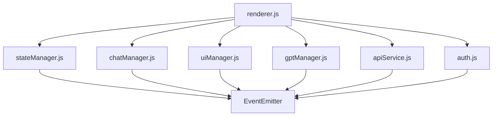

# 🛠️ Guia de Desenvolvimento - LexiDecis

## 📋 Índice

1. [Configuração do Ambiente](#configuração-do-ambiente)
2. [Arquitetura do Projeto](#arquitetura-do-projeto)
3. [Padrões de Código](#padrões-de-código)
4. [Sistema de Testes](#sistema-de-testes)
5. [Fluxo de Desenvolvimento](#fluxo-de-desenvolvimento)
6. [Debugging e Troubleshooting](#debugging-e-troubleshooting)
7. [Deploy e Produção](#deploy-e-produção)

---

## 🚀 Configuração do Ambiente

### **Pré-requisitos**

```bash
# Node.js (versão 14+)
node --version

# Python 3 (para servidor local)
python3 --version

# Git
git --version
```

### **Configuração Inicial**

```bash
# 1. Clone o repositório
git clone [url-do-repositorio]
cd lexidecis

# 2. Configure as variáveis de ambiente
cp .env.example .env
# Edite o arquivo .env com suas configurações

# 3. Instale dependências (se houver)
npm install

# 4. Inicie o servidor de desenvolvimento
python3 -m http.server 8000
```

### **Estrutura de Configuração**

```javascript
// config/app.config.js
export const APP_CONFIG = {
    // Configurações da aplicação
    app: {
        name: 'LexiDecis',
        version: '1.0.0',
        environment: process.env.NODE_ENV || 'development'
    },
    
    // Configurações de API
    api: {
        baseUrl: process.env.API_BASE_URL || 'http://localhost:8000',
        timeout: 30000,
        retries: 3
    },
    
    // Configurações Firebase
    firebase: {
        apiKey: process.env.FIREBASE_API_KEY,
        authDomain: process.env.FIREBASE_AUTH_DOMAIN,
        projectId: process.env.FIREBASE_PROJECT_ID,
        storageBucket: process.env.FIREBASE_STORAGE_BUCKET,
        messagingSenderId: process.env.FIREBASE_MESSAGING_SENDER_ID,
        appId: process.env.FIREBASE_APP_ID
    }
};
```

---

## 🏗️ Arquitetura do Projeto

### **Padrão Modular**

O projeto segue uma arquitetura modular baseada em serviços:

```
services/
├── stateManager.js      # 🧠 Gerenciamento de estado
├── chatManager.js       # 💬 Gerenciamento de chats
├── uiManager.js         # 🎨 Interface do usuário
├── gptManager.js        # 🤖 Gerenciamento de IA
├── apiService.js        # 🌐 Comunicação com APIs
├── auth.js             # 🔐 Autenticação
├── unifiedLoadingManager.js # ⏳ Sistema de loading
└── renderer.js         # 🎭 Orquestrador principal
```

### **Fluxo de Dados**



### **Sistema de Eventos**

```javascript
// Exemplo de uso do EventEmitter
class StateManager extends EventEmitter {
    constructor() {
        super();
        this.state = {
            session: {},
            chat: {},
            gpt: {}
        };
    }
    
    updateState(newState) {
        this.state = { ...this.state, ...newState };
        this.emit('stateChanged', this.state);
    }
}

// Uso em outros módulos
stateManager.on('stateChanged', (newState) => {
    console.log('Estado atualizado:', newState);
});
```

---

## 📝 Padrões de Código

### **JavaScript ES6+**

```javascript
// ✅ BOM - Use módulos ES6
import { StateManager } from './services/stateManager.js';
import { ChatManager } from './services/chatManager.js';

// ✅ BOM - Use async/await
async function sendMessage(message) {
    try {
        const response = await apiService.post('/chat', { message });
        return response.data;
    } catch (error) {
        console.error('Erro ao enviar mensagem:', error);
        throw error;
    }
}

// ✅ BOM - Use destructuring
const { userId, sessionId } = stateManager.getState().session;

// ✅ BOM - Use arrow functions
const handleClick = () => {
    // lógica aqui
};

// ❌ EVITE - Não use var
var oldWay = 'não use isso';

// ❌ EVITE - Não use callbacks aninhados
function badExample() {
    api.get('/data', function(response) {
        api.get('/more', function(response2) {
            // callback hell
        });
    });
}
```

### **CSS e Styling**

```css
/* ✅ BOM - Use metodologia BEM */
.chat-container {
    /* Container principal */
}

.chat-container__message {
    /* Elemento do container */
}

.chat-container__message--user {
    /* Modificador */
}

/* ✅ BOM - Use variáveis CSS */
:root {
    --primary-color: #007bff;
    --secondary-color: #6c757d;
    --success-color: #28a745;
    --error-color: #dc3545;
}

.chat-button {
    background-color: var(--primary-color);
    color: white;
    padding: 12px 24px;
    border-radius: 8px;
    border: none;
    cursor: pointer;
    transition: all 0.3s ease;
}

.chat-button:hover {
    background-color: var(--secondary-color);
    transform: translateY(-2px);
}
```

### **HTML Semântico**

```html
<!-- ✅ BOM - Use HTML semântico -->
<main class="chat-application">
    <header class="chat-header">
        <h1>LexiDecis Chat</h1>
        <nav class="chat-navigation">
            <!-- navegação aqui -->
        </nav>
    </header>
    
    <section class="chat-container">
        <article class="chat-messages">
            <!-- mensagens aqui -->
        </article>
        
        <form class="chat-input-form">
            <input type="text" placeholder="Digite sua mensagem..." />
            <button type="submit">Enviar</button>
        </form>
    </section>
    
    <aside class="chat-sidebar">
        <!-- sidebar aqui -->
    </aside>
</main>
```

---

## 🧪 Sistema de Testes

### **Estrutura de Testes**

```
tests/
├── chat-app/
│   ├── unit/           # Testes unitários
│   ├── integration/    # Testes de integração
│   ├── e2e/           # Testes end-to-end
│   ├── performance/   # Testes de performance
│   └── utils/         # Utilitários de teste
└── index.html         # Índice centralizado
```

### **Escrevendo Testes**

```javascript
// Exemplo de teste unitário
import { TestManager, Assert, Logger } from '../utils/testHelpers.js';
import { MockStateManager } from './mocks/stateManager.mock.js';

const testManager = new TestManager('StateManager Tests');
const logger = new Logger();

testManager.addTest('Deve inicializar com estado padrão', () => {
    const stateManager = new MockStateManager();
    const state = stateManager.getState();
    
    Assert.isDefined(state);
    Assert.hasProperty(state, 'session');
    Assert.hasProperty(state, 'chat');
    Assert.hasProperty(state, 'gpt');
    
    logger.success('Estado inicializado corretamente');
});

testManager.addTest('Deve atualizar estado corretamente', () => {
    const stateManager = new MockStateManager();
    const newState = { session: { userId: '123' } };
    
    stateManager.updateState(newState);
    const currentState = stateManager.getState();
    
    Assert.equals(currentState.session.userId, '123');
    logger.success('Estado atualizado corretamente');
});

// Executar testes
testManager.runAllTests();
```

### **Executando Testes**

```bash
# Iniciar servidor de testes
python3 -m http.server 8000

# Acessar índice de testes
open http://localhost:8000/tests/index.html

# Executar testes específicos
open http://localhost:8000/tests/chat-app/unit/services/stateManager.test.html

# Executar via script
./tests/chat-app/scripts/run-all-tests.sh
```

---

## 🔄 Fluxo de Desenvolvimento

### **1. Preparação**

```bash
# Crie uma branch para sua feature
git checkout -b feature/nova-funcionalidade

# Atualize sua branch
git pull origin main
```

### **2. Desenvolvimento**

```bash
# Inicie o servidor de desenvolvimento
python3 -m http.server 8000

# Acesse a aplicação
open http://localhost:8000/pages/chat.html

# Abra o console do navegador para debug
# F12 > Console
```

### **3. Testes**

```bash
# Execute os testes existentes
open http://localhost:8000/tests/index.html

# Crie novos testes se necessário
# tests/chat-app/unit/services/seu-servico.test.html
```

### **4. Commit e Push**

```bash
# Adicione suas mudanças
git add .

# Faça o commit com mensagem descritiva
git commit -m "feat: adiciona nova funcionalidade de chat

- Implementa sistema de notificações
- Adiciona testes unitários
- Atualiza documentação"

# Push para o repositório
git push origin feature/nova-funcionalidade
```

### **5. Pull Request**

1. Crie um Pull Request no GitHub
2. Descreva as mudanças
3. Adicione screenshots se necessário
4. Aguarde a revisão

---

## 🐛 Debugging e Troubleshooting

### **Console Logging**

```javascript
// ✅ BOM - Use logs estruturados
console.group('🔧 StateManager Debug');
console.log('Estado atual:', state);
console.log('Ação executada:', action);
console.log('Timestamp:', new Date().toISOString());
console.groupEnd();

// ✅ BOM - Use diferentes níveis de log
console.info('ℹ️ Informação geral');
console.warn('⚠️ Aviso importante');
console.error('❌ Erro crítico');
console.debug('🐛 Debug detalhado');
```

### **Ferramentas de Debug**

```javascript
// Debug de estado
console.log('Estado completo:', JSON.stringify(stateManager.getState(), null, 2));

// Debug de performance
console.time('Operação lenta');
// ... código aqui
console.timeEnd('Operação lenta');

// Debug de eventos
stateManager.on('stateChanged', (newState) => {
    console.log('🔄 Estado mudou:', newState);
});
```

### **Problemas Comuns**

#### **Erro 404 em imports**
```bash
# ❌ Problema: Imports não funcionam
GET http://localhost:8000/services/stateManager.js net::ERR_ABORTED 404

# ✅ Solução: Use servidor HTTP
python3 -m http.server 8000
# Acesse via http://localhost:8000/pages/chat.html
```

#### **Erro de CORS**
```javascript
// ❌ Problema: Erro de CORS em APIs
Access to fetch at 'https://api.openai.com' from origin 'http://localhost:8000' has been blocked by CORS policy

// ✅ Solução: Configure CORS no servidor ou use proxy
const API_PROXY = 'https://cors-anywhere.herokuapp.com/';
```

#### **Erro de autenticação**
```javascript
// ❌ Problema: Usuário não autenticado
Firebase: Error (auth/user-not-found).

// ✅ Solução: Verifique configuração Firebase
console.log('Firebase config:', firebaseConfig);
```

---

## 🚀 Deploy e Produção

### **Preparação para Produção**

```bash
# 1. Minifique assets
npm run build

# 2. Configure variáveis de ambiente
cp .env.example .env.production
# Edite .env.production

# 3. Teste em ambiente de staging
python3 -m http.server 8000
# Teste todas as funcionalidades
```

### **Configuração de Servidor**

```nginx
# Exemplo de configuração Nginx
server {
    listen 80;
    server_name lexidecis.com;
    
    location / {
        root /var/www/lexidecis;
        index index.html;
        try_files $uri $uri/ /index.html;
    }
    
    # Configuração de cache
    location ~* \.(js|css|png|jpg|jpeg|gif|ico|svg)$ {
        expires 1y;
        add_header Cache-Control "public, immutable";
    }
    
    # Configuração de segurança
    add_header X-Frame-Options "SAMEORIGIN";
    add_header X-Content-Type-Options "nosniff";
    add_header X-XSS-Protection "1; mode=block";
}
```

### **Monitoramento**

```javascript
// Exemplo de monitoramento de performance
class PerformanceMonitor {
    constructor() {
        this.metrics = {
            loadTime: 0,
            apiResponseTime: 0,
            memoryUsage: 0
        };
    }
    
    measureLoadTime() {
        const start = performance.now();
        window.addEventListener('load', () => {
            this.metrics.loadTime = performance.now() - start;
            console.log('⏱️ Tempo de carregamento:', this.metrics.loadTime);
        });
    }
    
    measureApiCall(apiCall) {
        const start = performance.now();
        return apiCall().then(() => {
            this.metrics.apiResponseTime = performance.now() - start;
            console.log('🌐 Tempo de resposta API:', this.metrics.apiResponseTime);
        });
    }
}
```

---

## 📚 Recursos Adicionais

### **Documentação Técnica**
- [📋 Estratégia de Testes](tests/chat-app/ESTRATEGIA_TESTES.md)
- [🔧 Referência Técnica](docs/TECHNICAL_REFERENCE.md)
- [🎨 Gerenciamento de Cores](docs/CHATBOT_COLOR_MANAGEMENT.md)

### **Ferramentas Recomendadas**
- **VS Code**: Editor principal
- **Chrome DevTools**: Debug e performance
- **Postman**: Teste de APIs
- **Lighthouse**: Análise de performance

### **Comandos Úteis**

```bash
# Limpar cache do navegador
# Chrome: Ctrl+Shift+R (Windows) / Cmd+Shift+R (Mac)

# Verificar logs do servidor
tail -f /var/log/nginx/access.log

# Monitorar uso de memória
node --inspect-brk=0.0.0.0:9229 app.js

# Testar APIs
curl -X POST http://localhost:8000/api/chat \
  -H "Content-Type: application/json" \
  -d '{"message": "Olá!"}'
```

---

## 🤝 Contribuição

### **Checklist de Qualidade**

- [ ] Código segue padrões estabelecidos
- [ ] Testes foram escritos e passam
- [ ] Documentação foi atualizada
- [ ] Performance foi testada
- [ ] Responsividade foi verificada
- [ ] Acessibilidade foi considerada

### **Revisão de Código**

1. **Funcionalidade**: O código faz o que deveria?
2. **Performance**: Há impactos na performance?
3. **Segurança**: Há vulnerabilidades?
4. **Manutenibilidade**: O código é fácil de manter?
5. **Testes**: Há cobertura adequada de testes?

---

**🧪 LexiDecis** - Guia de Desenvolvimento | Versão 1.0 | Criado com ❤️ para qualidade 